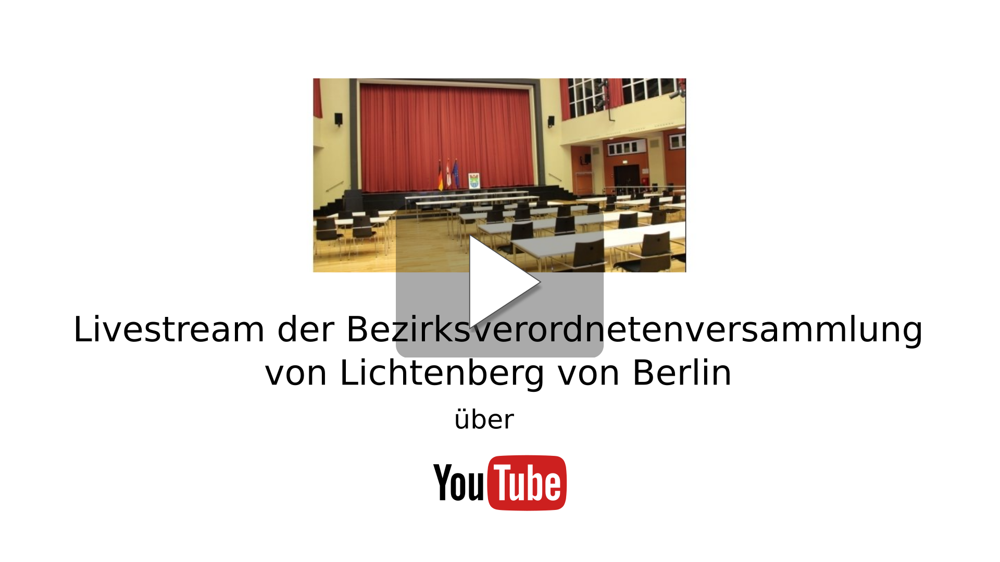

# Nächste Sendung

10.12.2020 17:00 Uhr
Aufgrund der aktuellen Pandemie ist der Termin noch unbestätigt.

# Wichtige Informationen
[Sitzungskalender](https://www.berlin.de/ba-lichtenberg/politik-und-verwaltung/bezirksverordnetenversammlung/online/si010.asp)

[Tagesordnung](https://www.berlin.de/ba-lichtenberg/politik-und-verwaltung/bezirksverordnetenversammlung/online/to010.asp?SILFDNR=4660)

[Ort](https://www.openstreetmap.de/karte.html?zoom=16&lat=52.51496&lon=13.47951&layers=00B0TT )

## Adresse

Max-Taut-Aula

Fischerstr. 36

10317 Berlin
