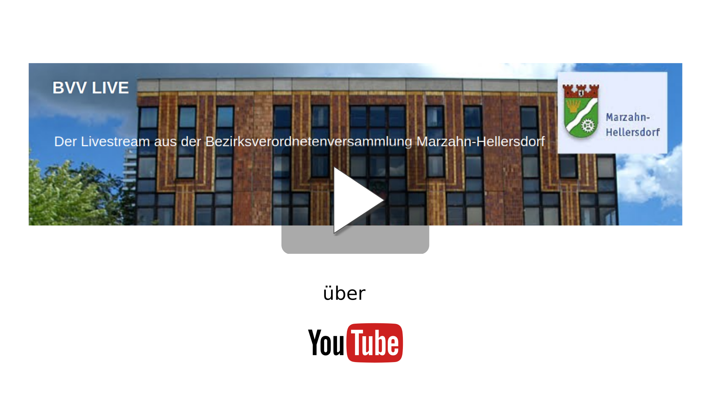

# Nächste Sendung

17.12.2020 17:00 Uhr

# Wichtige Informationen
[Sitzungskalender](https://www.berlin.de/ba-marzahn-hellersdorf/politik-und-verwaltung/bezirksverordnetenversammlung/online/si010.asp)

[Tagesordnung](https://www.berlin.de/ba-marzahn-hellersdorf/politik-und-verwaltung/bezirksverordnetenversammlung/online/to010.asp?SILFDNR=5373)

[Ort](https://www.openstreetmap.de/karte.html?zoom=16&lat=52.54613&lon=13.5598&layers=00B0TT)

## Adresse

Freizeitforum Marzahn

Marzahner Promenade 55

12679 Berlin

